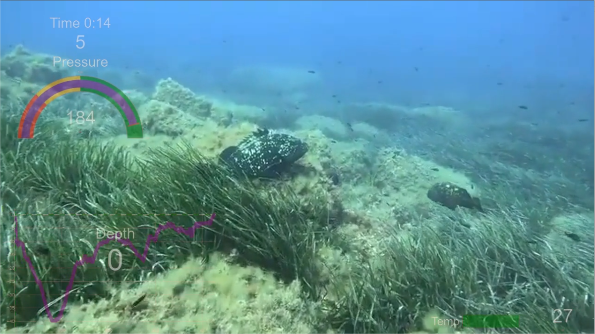

# Background for video diving

Software for adding a HUD to scuba diving video. HUD data is retrieved from the dive computer via Subsurface software in .csv format. Thanks to Luc (https://www.youtube.com/@lpr3233) for his video and datas !

Do not hesitate to send comments or screenshots on my Mastodon (https://mastodon.social/@joseph_arias) ! 



## How to use ?

It's necessary to run command :
```
python3 CreateBgForVideoWithFFMEG.py
```

For 1h of .csv data, a 200 Mo video is created so you need to have storage.

For now, parameters aren't dynamicals, it's necesary to modify the source.

## PIP install

```
pip install -U plotly
```

## My Note

### Issue 1 :

To fix :
```
ModuleNotFoundError: No module named 'distutils.cmd'
```

Install :
```
# sudo apt-get install python3-distutils
```

### Issue 2 :

To fix :
```
Unknown encoder 'libvo_aacenc'
```

Install :
```
# sudo apt-get install libavcodec-extra
# sudo apt-get install libvo-aacenc0
# sudo apt-get install libvo-aacenc-dev
```

### Information of video format in command line :

```
ffprobe -v quiet -print_format json -show_format -show_streams istockphoto-1225539894-640_adpp_is.mp4
```

### To download video on Youtube for test

### Merge video in command line

```
ffmpeg -i istockphoto-1225539894-640_adpp_is.mp4 -i video.mp4 -filter_complex " \
        [0:v]setpts=PTS-STARTPTS, scale=480x360[top]; \
        [1:v]setpts=PTS-STARTPTS, scale=480x360, \
             format=yuva420p,colorchannelmixer=aa=0.5[bottom]; \
        [top][bottom]overlay=shortest=1" -acodec libvo_aacenc -vcodec libx264 out.mp4 
```

### Compress video in commande line

```
ffmpeg -i video.mp4 -vcodec libx265 -crf 28 video-compress.mp4
```

### Cut vide

```
ffmpeg -ss 00:02:28 -to 00:03:00 -i videomergecompress.mp4  -async 1  videomergecompresscut.mp4
```

## Doc used 

(https://plotly.com/python/indicator/)

## Licence

Free but I like sushis !

